##

::: {style="position: absolute; left: 250px; top: 50px; height: 200px; width: 1950px; background-color: #d0f0c070; padding: 20px; padding-left: 50px; text-align: center;"}
[The Pathway of a Marine Ecologist, Statistician and Coder.]{style="font-size: 90px; font-weight: bold; line-height: 1em; margin: 0px"}

:::

::: {.absolute bottom="36.5%" left="15%"}
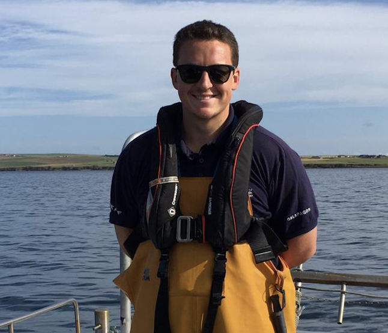{height="510"}
:::

::: {.absolute bottom="22%" right="8%"}
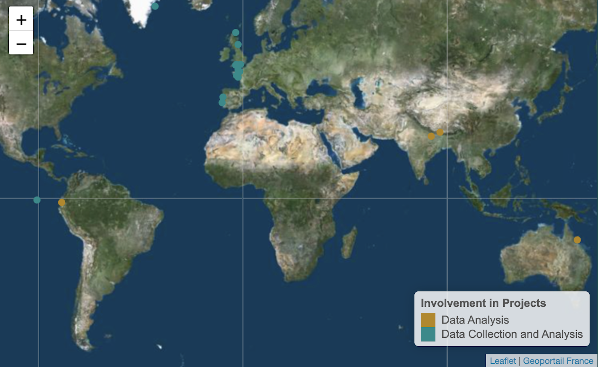{height="707"}
:::

::: {style="position: absolute; left: 360px; top: 830px; height: 150px; width: 500px; background-color: #d0f0c070; padding: 20px; padding-left: 50px;"}

[Bede Ffinian Rowe Davies]{style="font-size: 45px; font-weight: bold;"}

[Post-Doctoral Researcher]{style="font-size: 30px; font-weight: bold;"}

:::: 

::: {style="position: absolute; left: 250px; top: 1040px; height: 200px; width: 1950px; background-color: #d0f0c070; padding: 20px; padding-left: 50px; text-align: center;"}

[From my Undergraduate Degree in the UK to Post-Doctoral Research in France.]{style="font-size: 70px; font-weight: bold;"}

:::

## Overview Studies {style="font-size: 60px; font-weight: bold;"}

::: {.absolute top="0" left="95%"}
::: {.sectionhead}
1 [2 3 4 5 6]{style="opacity:0.25"}
:::
:::

::: {.incremental}

- [Undergraduate Degree (MSci University of Southampton):]{style="font-size: 50px;"}

    - [Fish Rareness Australian Marine Protected Areas (Starting R)]{style="font-size: 40px;"}

    - [Thesis assessing UK Native Oyster Fishery]{style="font-size: 40px;"}

- [PhD (Back in UK in Plymouth):]{style="font-size: 50px;"}

    - [Lyme Bay Marine Protected Area]{style="font-size: 40px;"}

    - [Orkney Offshore Energy]{style="font-size: 40px;"}

    - [Jersey Sedimentary Blue Carbon]{style="font-size: 40px;"}

- [Post Doc (Nantes, France):]{style="font-size: 50px;"}

    - [Seagrass Cover across Europe]{style="font-size: 40px;"}

:::

::: {.absolute bottom="5%" right="6%"}
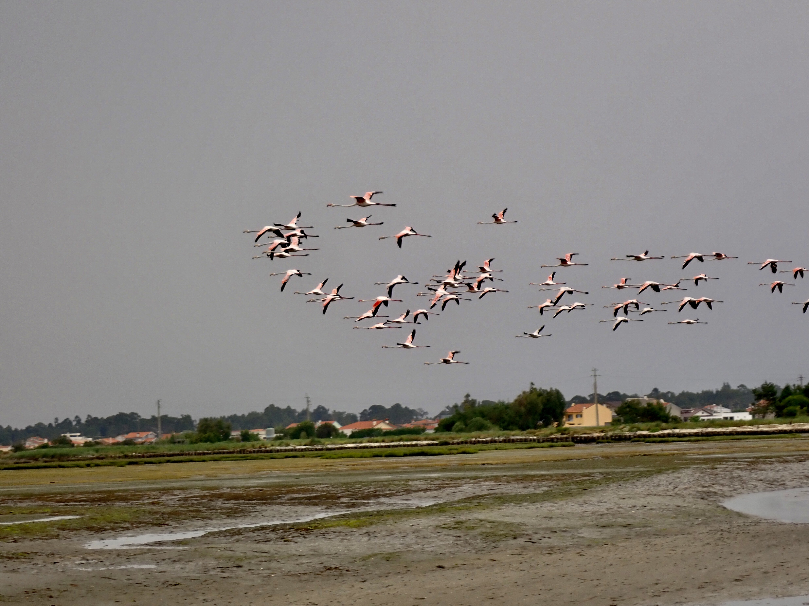{height="800"}
:::

## Overview Consultant {style="font-size: 60px; font-weight: bold;"}

::: {.absolute top="0" left="95%"}
::: {.sectionhead}
1 [2 3 4 5 6]{style="opacity:0.25"}
:::
:::

::: {.incremental}

- [South America:]{style="font-size: 50px;"}

    - [Galapagos Islands: Charles Darwin Research Station]{style="font-size: 40px;"}

    - [Ecuador Mainland: Instituto Nacional de Pesca]{style="font-size: 40px;"}

- [Asian Plastics Pollution:]{style="font-size: 50px;"}

    - [Highest Recorded Plastics Pollution Everest]{style="font-size: 40px;"}

    - [Plastics Along the Ganges]{style="font-size: 40px;"}

- [Arctic Fisheries:]{style="font-size: 50px;"}

    - [Greenlandic Cod]{style="font-size: 40px;"}

:::

::: {.absolute bottom="15%" right="2%"}
{height="650"}
:::

## University of Southampton {style="font-size: 60px; font-weight: bold;"}

::: {.absolute top="0" left="95%"}
::: {.sectionhead}
1 [2 3 4 5 6]{style="opacity:0.25"}
:::
:::

- [Master of Marine Biology:]{style="font-size: 70px;"}

    - [Lots of Oceanography]{style="font-size: 40px;"}

    - [Coding in R]{style="font-size: 40px;"}
  
    - [Using GLMMs to assess Reef Life Survey Data from Australia]{style="font-size: 40px;"}
    
    - [Using R to Make Maps]{style="font-size: 40px;"}

    - [GLMMs to assess Oyster Fishery Collapse]{style="font-size: 40px;"}

::: {.absolute bottom="10%" right="2%"}
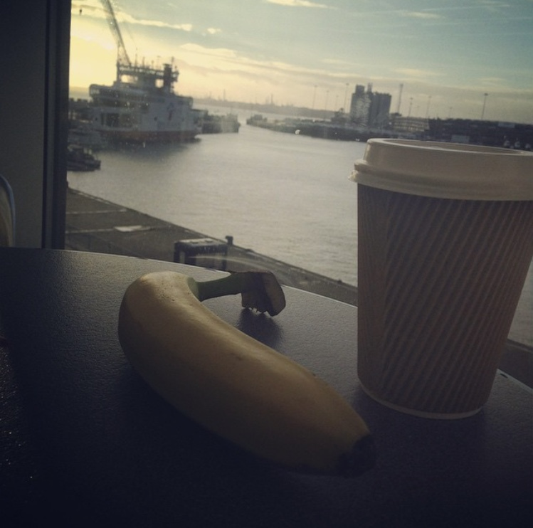{height="900"}
:::

## University of Southampton {style="font-size: 60px; font-weight: bold;"}

::: {.absolute top="0" left="95%"}
::: {.sectionhead}
1 [2 3 4 5 6]{style="opacity:0.25"}
:::
:::

- [Master of Marine Biology:]{style="font-size: 70px;"}

    - [Lots of Oceanography]{style="font-size: 40px;"}

    - [Coding in R]{style="font-size: 40px;"}
  
    - [Using GLMMs to assess Reef Life Survey Data from Australia]{style="font-size: 40px;"}
    
    - [Using R to Make Maps]{style="font-size: 40px;"}

    - [GLMMs to assess Oyster Fishery Collapse]{style="font-size: 40px;"}

::: {.absolute bottom="10%" right="2%"}
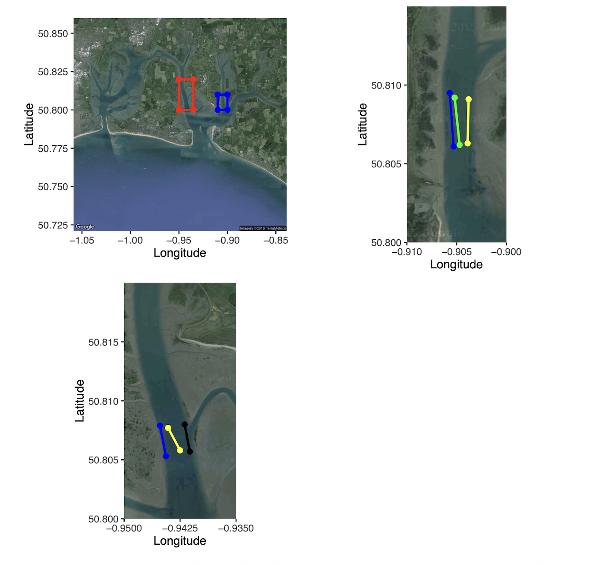{height="900"}
:::

## University of Southampton {style="font-size: 60px; font-weight: bold;"}

::: {.absolute top="0" left="95%"}
::: {.sectionhead}
1 [2 3 4 5 6]{style="opacity:0.25"}
:::
:::

- [Master of Marine Biology:]{style="font-size: 70px;"}

    - [Lots of Oceanography]{style="font-size: 40px;"}

    - [Coding in R]{style="font-size: 40px;"}
  
    - [Using GLMMs to assess Reef Life Survey Data from Australia]{style="font-size: 40px;"}
    
    - [Using R to Make Maps]{style="font-size: 40px;"}

    - [GLMMs to assess Oyster Fishery Collapse]{style="font-size: 40px;"}

::: {.absolute bottom="10%" right="2%"}
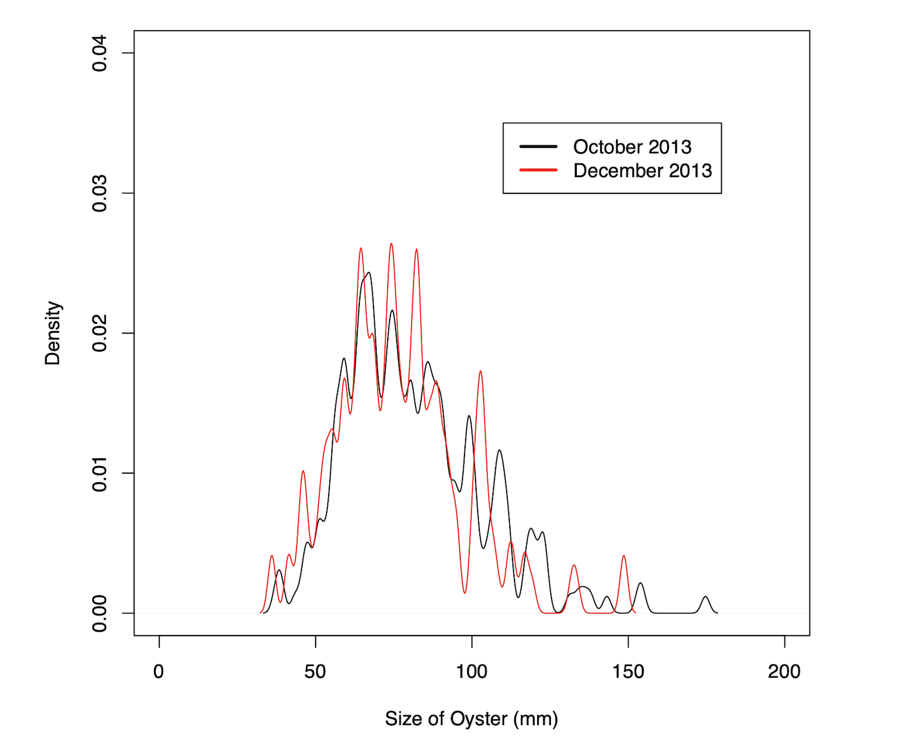{height="900"}
:::

## Galapagos Islands Invasive Species {style="font-size: 60px; font-weight: bold;"}

::: {.absolute top="0" left="95%"}
::: {.sectionhead}
[1]{style="opacity:0.25"} 2 [3 4 5 6]{style="opacity:0.25"}
:::
:::

::: {.absolute bottom="5%" left="1%"}
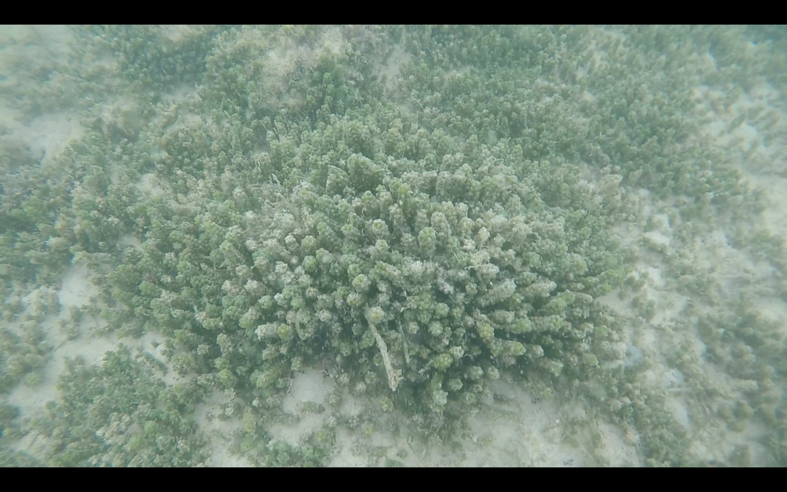{height="1000"}
:::

::: {.absolute bottom="5%" right="1%"}
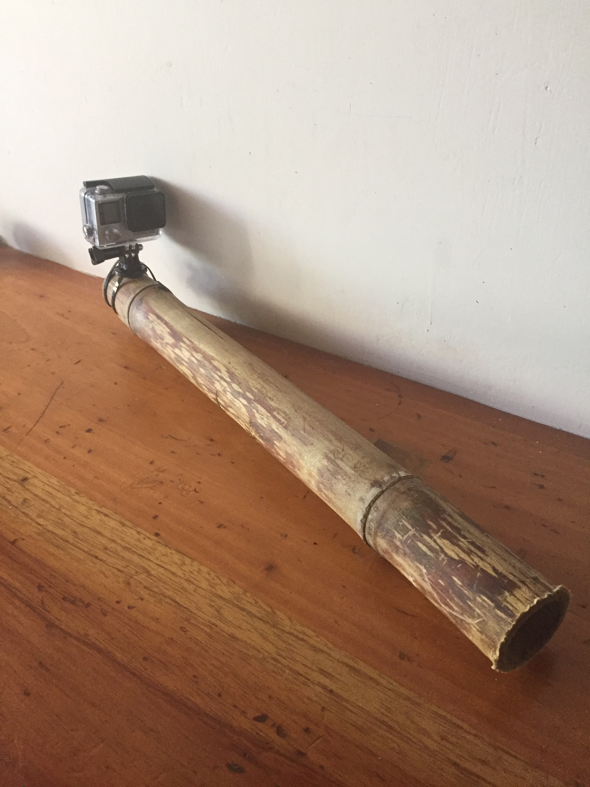{height="1000"}
:::

## Galapagos Islands Invasive Species {style="font-size: 60px; font-weight: bold;"}

::: {.absolute top="0" left="95%"}
::: {.sectionhead}
[1]{style="opacity:0.25"} 2 [3 4 5 6]{style="opacity:0.25"}
:::
:::



## Galapagos Islands Invasive Species {style="font-size: 60px; font-weight: bold;"}

::: {.absolute top="0" left="95%"}
::: {.sectionhead}
[1]{style="opacity:0.25"} 2 [3 4 5 6]{style="opacity:0.25"}
:::
:::

::: {.absolute bottom="5%" left="1%"}
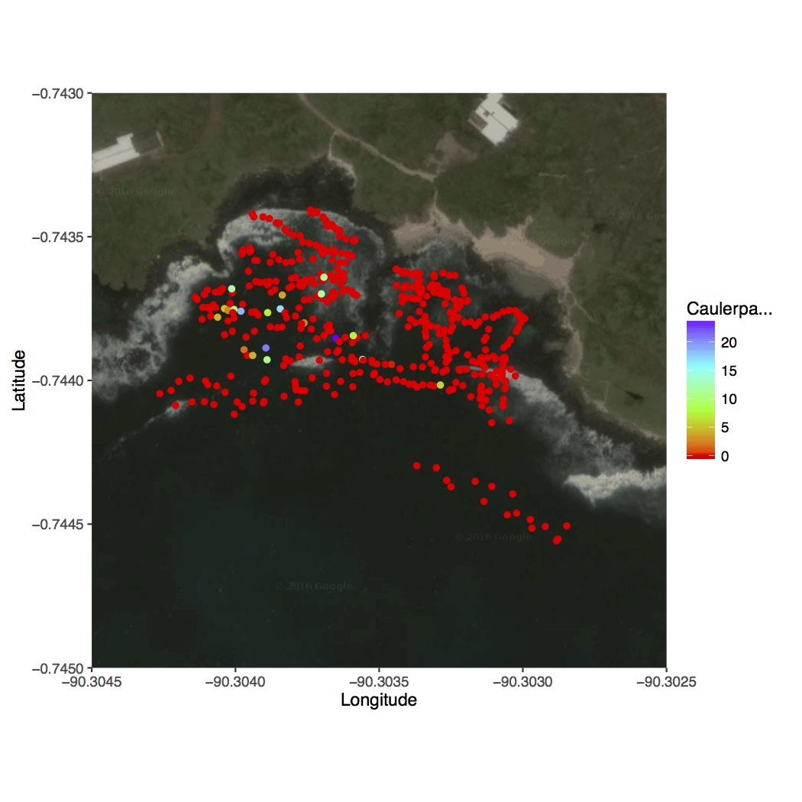{height="1100"}
:::

::: {.absolute bottom="0%" right="4%"}
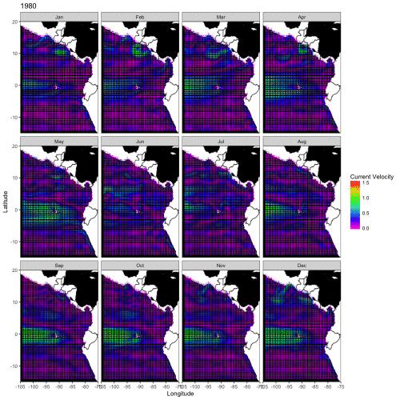{height="1200"}
:::

## Galapagos Islands Plastics {style="font-size: 60px; font-weight: bold;"}

::: {.absolute top="0" left="95%"}
::: {.sectionhead}
[1]{style="opacity:0.25"} 2 [3 4 5 6]{style="opacity:0.25"}
:::
:::

::: {.absolute bottom="5%" left="15%"}
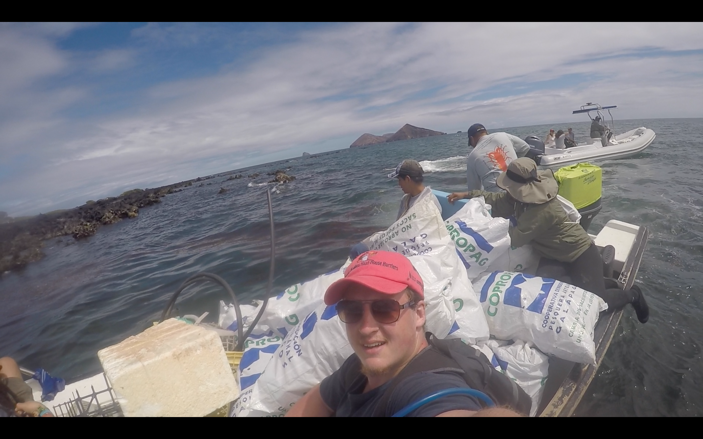{height="1100"}
:::

## Galapagos Islands Plastics {style="font-size: 60px; font-weight: bold;"}

::: {.absolute top="0" left="95%"}
::: {.sectionhead}
[1]{style="opacity:0.25"} 2 [3 4 5 6]{style="opacity:0.25"}
:::
:::

::: {.absolute bottom="5%" left="15%"}
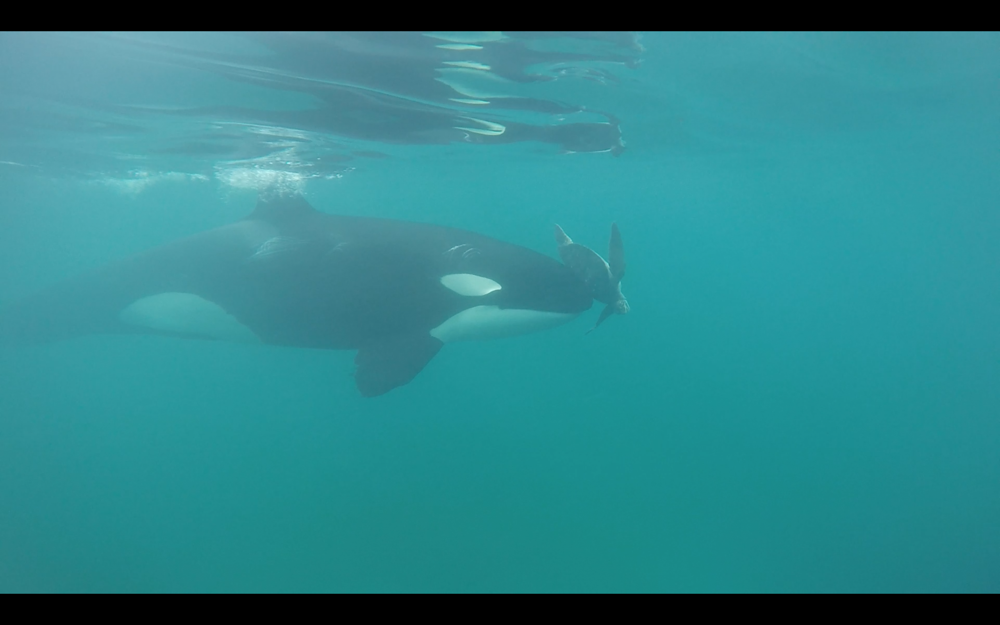{height="1100"}
:::

## Ecuador Statistics and Longline Fisheries {style="font-size: 60px; font-weight: bold;"}

::: {.absolute top="0" left="95%"}
::: {.sectionhead}
[1]{style="opacity:0.25"} 2 [3 4 5 6]{style="opacity:0.25"}
:::
:::

::: {.incremental}

- [Analysing Longline Experimental Fishery:]{style="font-size: 70px;"}
   
    - [GLMs of Experimentatal Method and its By Catch]{style="font-size: 40px;"}
    
    - [Deep Water Longlines = Less By Catch of Vulnerable Species]{style="font-size: 40px;"}
    
- [But:]{style="font-size: 70px;"}

    - [Worse than No Fishing]{style="font-size: 40px;"}

:::

::: {.absolute bottom="3%" right="10%"}
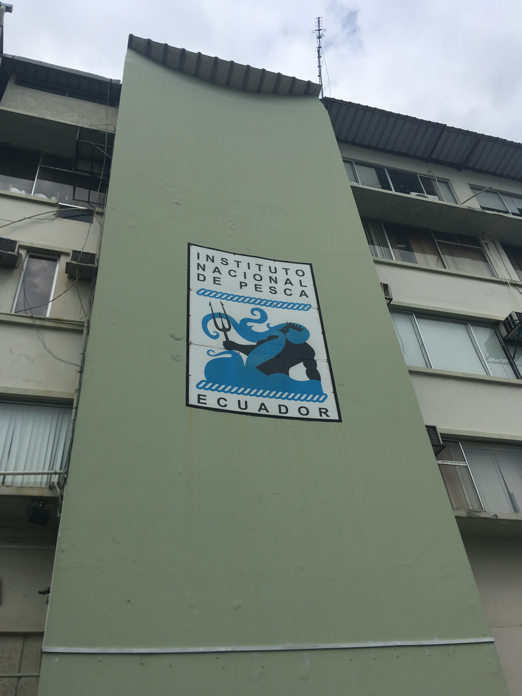{height="1100"}
:::

## Plymouth and PhD {style="font-size: 60px; font-weight: bold;"}

::: {.absolute top="0" left="95%"}
::: {.sectionhead}
[1 2]{style="opacity:0.25"} 3 [4 5 6]{style="opacity:0.25"}
:::
:::

::: {.absolute bottom="7%" left="1%"}
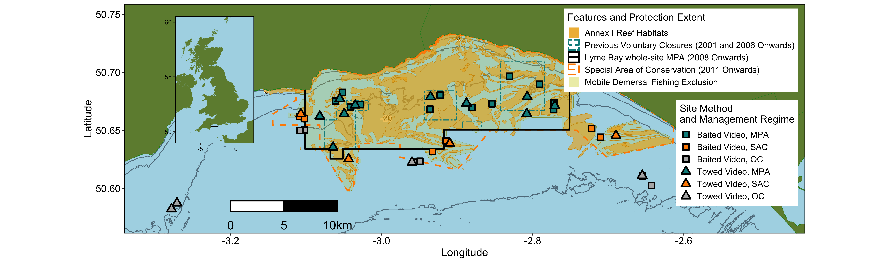{height="900"}
:::

## Plymouth and PhD {style="font-size: 60px; font-weight: bold;"}

::: {.absolute top="0" left="95%"}
::: {.sectionhead}
[1 2]{style="opacity:0.25"} 3 [4 5 6]{style="opacity:0.25"}
:::
:::

::: {.absolute bottom="5%" left="1%"}
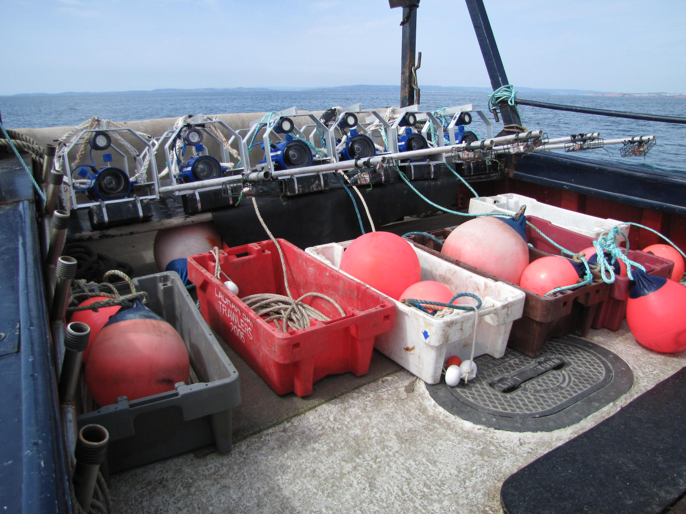{height="900"}
:::

::: {.absolute bottom="5%" right="1%"}
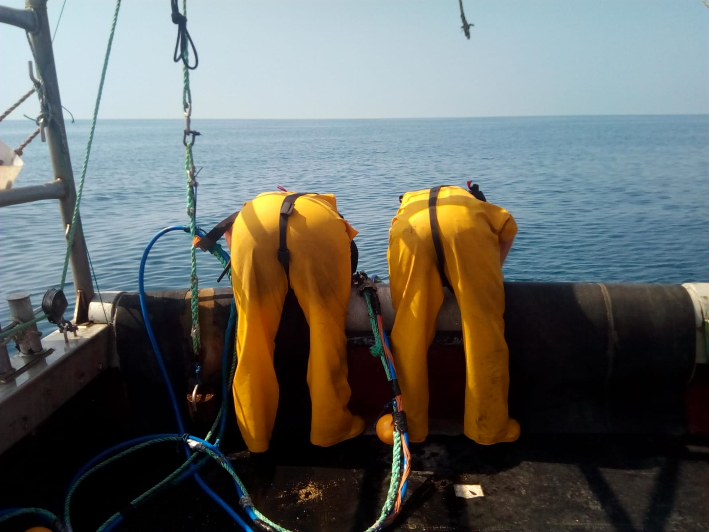{height="900"}
:::

## Plymouth and PhD {style="font-size: 60px; font-weight: bold;"}

::: {.absolute top="0" left="95%"}
::: {.sectionhead}
[1 2]{style="opacity:0.25"} 3 [4 5 6]{style="opacity:0.25"}
:::
:::



::: {.absolute bottom="17%" right="5%"}
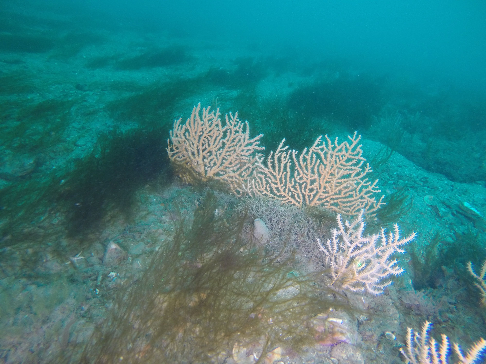{height="950"}
:::

## Plymouth and PhD {style="font-size: 60px; font-weight: bold;"}

::: {.absolute top="0" left="95%"}
::: {.sectionhead}
[1 2]{style="opacity:0.25"} 3 [4 5 6]{style="opacity:0.25"}
:::
:::

::: {.absolute bottom="10%" right="15%"}
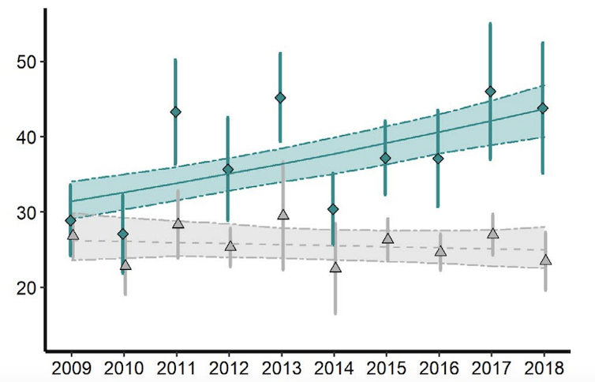{height="1000"}
:::

## Offshore Energy Orkney Islands {style="font-size: 60px; font-weight: bold;"}

::: {.absolute top="0" left="95%"}
::: {.sectionhead}
[1 2 3]{style="opacity:0.25"} 4 [5 6]{style="opacity:0.25"}
:::
:::

::: {.absolute bottom="10%" right="5%"}
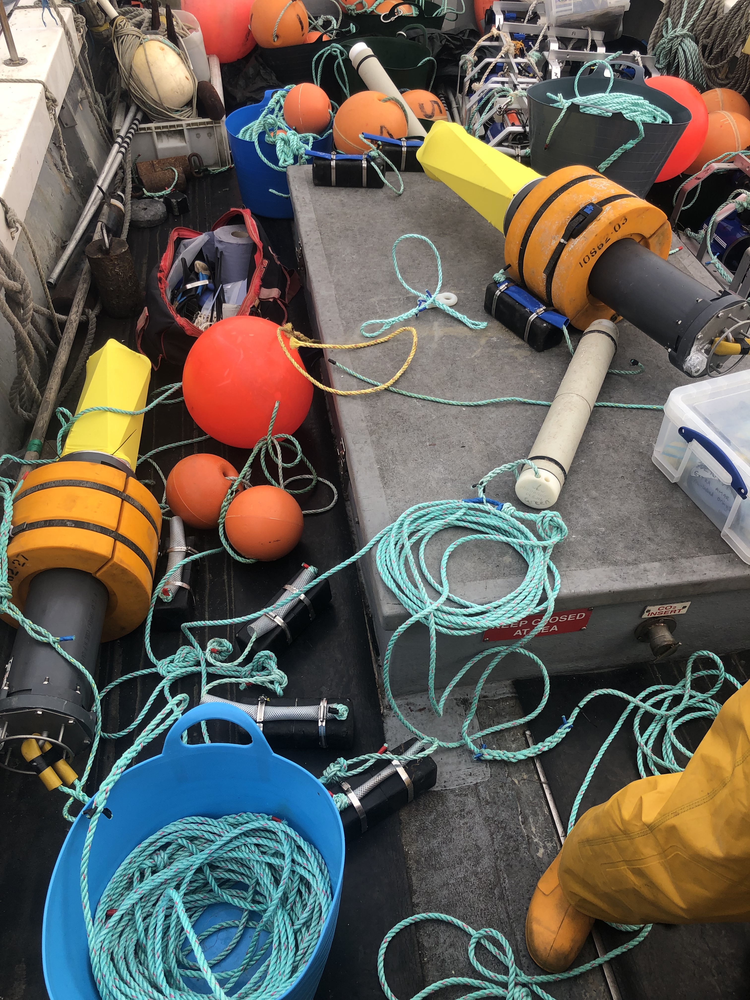{height="1000"}
:::

::: {.absolute bottom="10%" left="2%"}
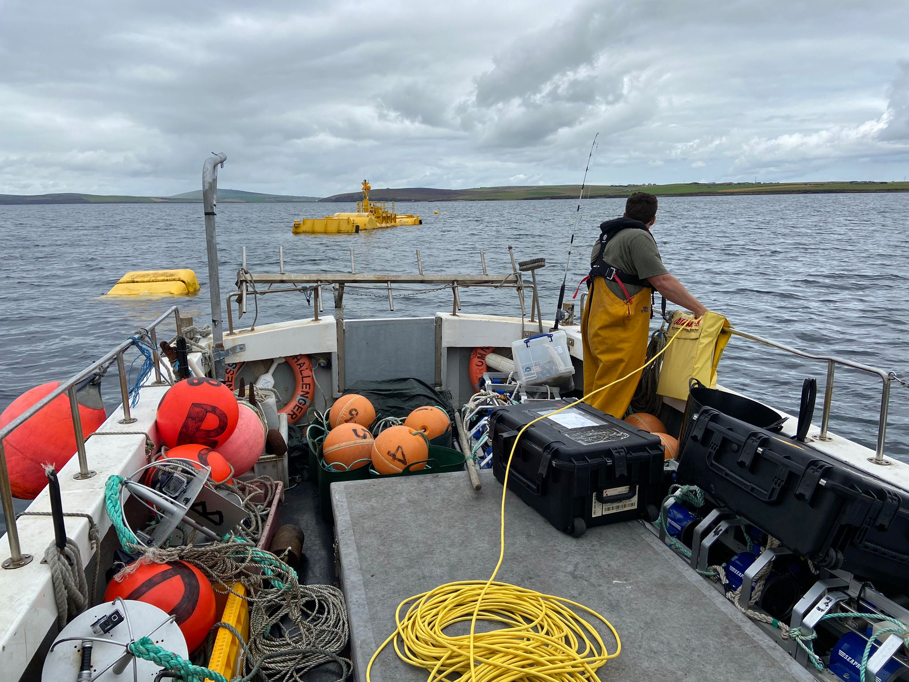{height="1000"}
:::

## Highest Plastics in the World: Everest (I didn't go there.) {style="font-size: 60px; font-weight: bold;"}

::: {.absolute top="0" left="95%"}
::: {.sectionhead}
[1 2 3]{style="opacity:0.25"} 4 [5 6]{style="opacity:0.25"}
:::
:::

::: {.absolute bottom="10%" right="2%"}
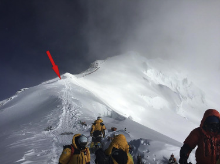{height="1000"}
:::

::: {.absolute bottom="10%" left="2%"}
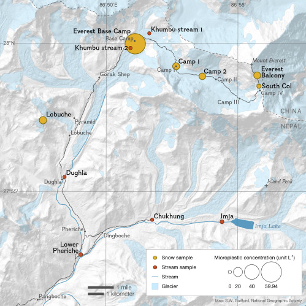{height="1000"}
:::

## Plastics in the World: Ganges (I didn't go there.) {style="font-size: 60px; font-weight: bold;"}

::: {.absolute top="0" left="95%"}
::: {.sectionhead}
[1 2 3]{style="opacity:0.25"} 4 [5 6]{style="opacity:0.25"}
:::
:::

::: {.absolute bottom="10%" right="35%"}
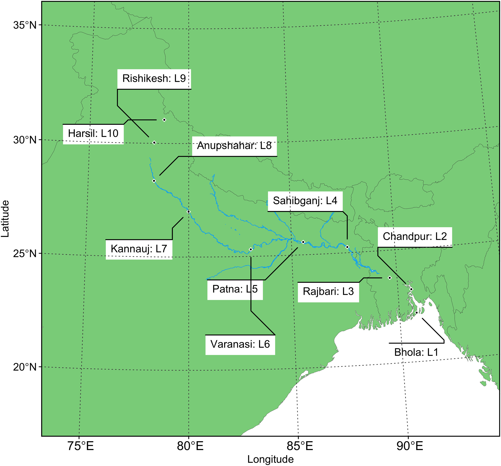{height="1000"}
:::

## Plastics in the World: Ganges (I didn't go there.) {style="font-size: 60px; font-weight: bold;"}

::: {.absolute top="0" left="95%"}
::: {.sectionhead}
[1 2 3]{style="opacity:0.25"} 4 [5 6]{style="opacity:0.25"}
:::
:::

::: {.absolute bottom="10%" left="2%"}
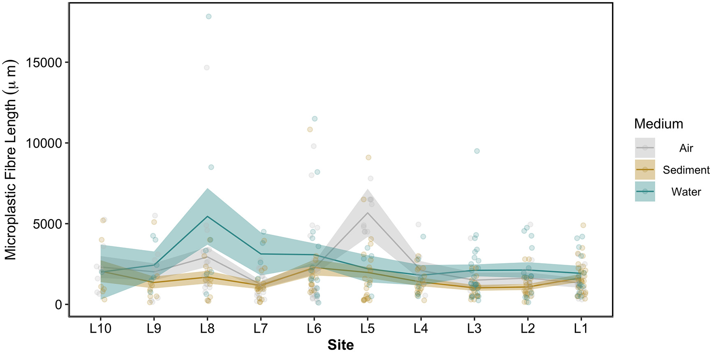{height="1000"}
:::

## Sedimentary Carbon Jersey {style="font-size: 60px; font-weight: bold;"}

::: {.absolute top="0" left="95%"}
::: {.sectionhead}
[1 2 3 4]{style="opacity:0.25"} 5 [6]{style="opacity:0.25"}
:::
:::

::: {.absolute bottom="10%" right="2%"}
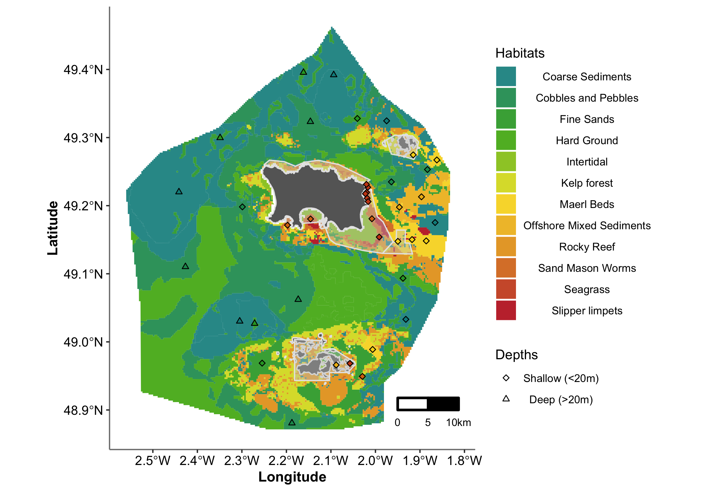{height="1000"}
:::

::: {.absolute bottom="10%" left="2%"}
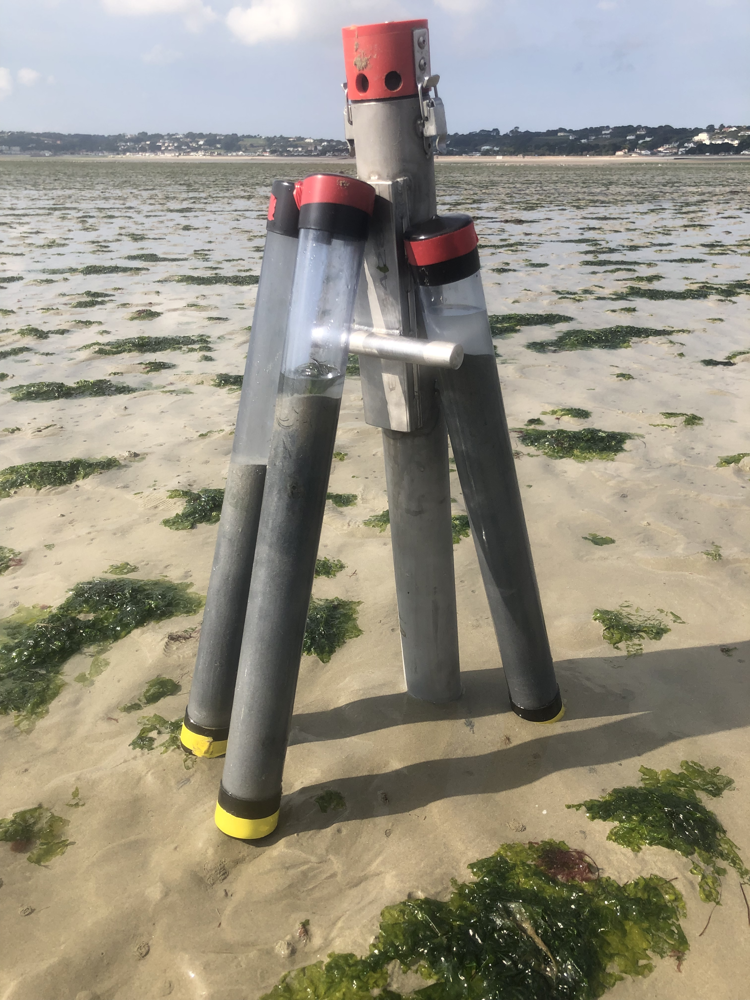{height="1000"}
:::

## Greenlandic Cod {style="font-size: 60px; font-weight: bold;"}

::: {.absolute top="0" left="95%"}
::: {.sectionhead}
[1 2 3 4]{style="opacity:0.25"} 5 [6]{style="opacity:0.25"}
:::
:::

::: {.absolute bottom="10%" right="4%"}
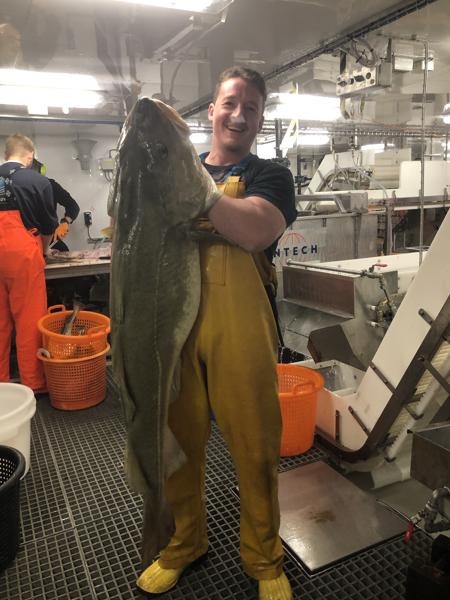{height="1000"}
:::

::: {.absolute bottom="10%" left="2%"}
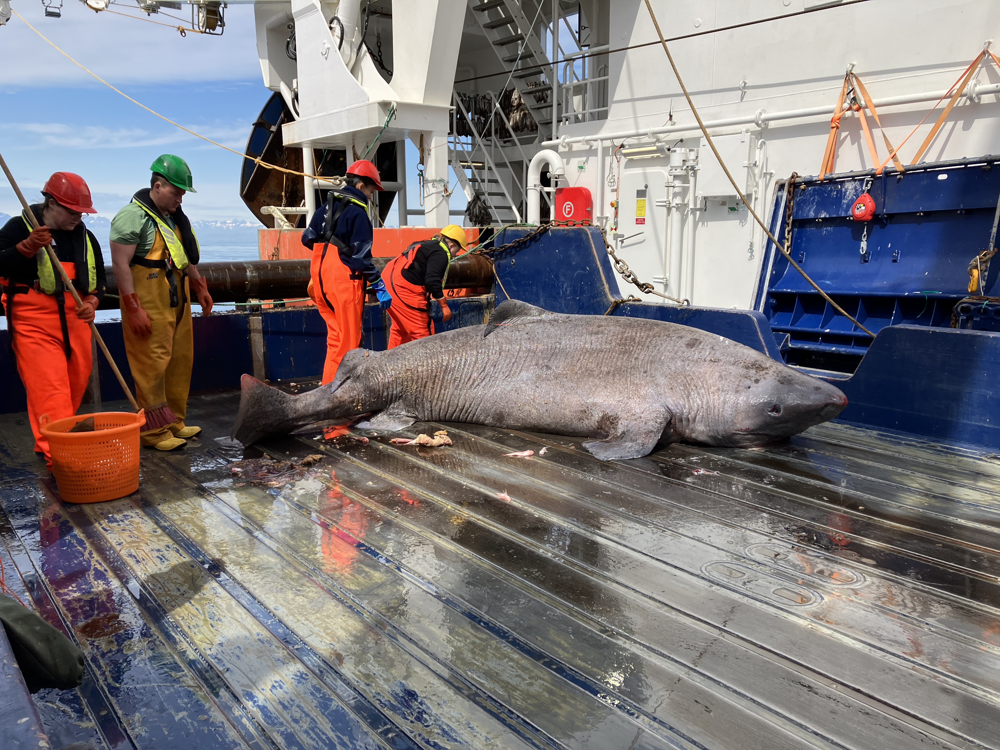{height="1000"}
:::

## Nantes: Remote Sensing Seagrass {style="font-size: 60px; font-weight: bold;"}

::: {.absolute top="0" left="95%"}
::: {.sectionhead}
[1 2 3 4 5]{style="opacity:0.25"} 6
:::
:::

::: {.absolute bottom="0%" left="6%"}
{height="1300"}
:::

::: {.absolute bottom="5%" right="6%"}
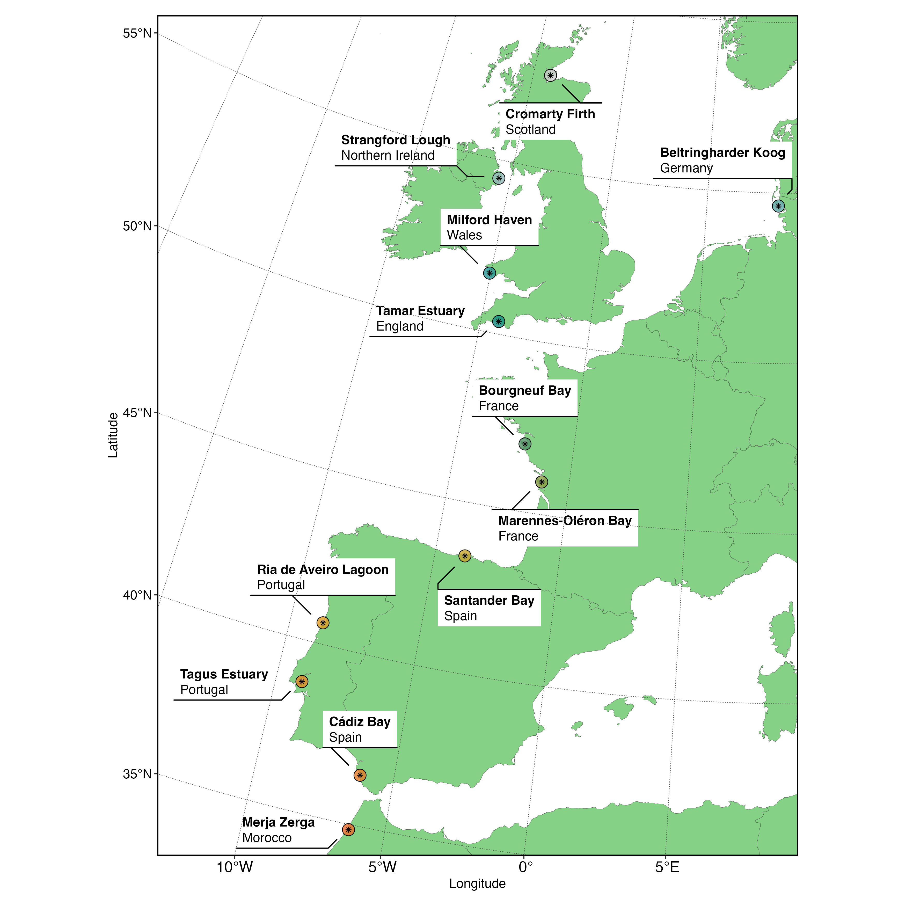{height="1120"}
:::

## Different Phenology across Europe {style="font-size: 60px; font-weight: bold;"}

::: {.absolute top="0" left="95%"}
::: {.sectionhead}
[1 2 3 4 5]{style="opacity:0.25"} 6
:::
:::

::: {.absolute bottom="0%" left="2%"}
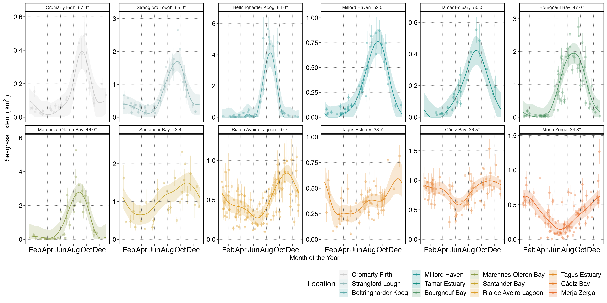{height="1150"}
:::

## Thank You {style="font-size: 60px; font-weight: bold;"}

::: {.absolute top="0" left="95%"}
::: {.sectionhead}
[1 2 3 4 5]{style="opacity:0.25"} 6
:::
:::

::: {.absolute bottom="0%" left="0%"}
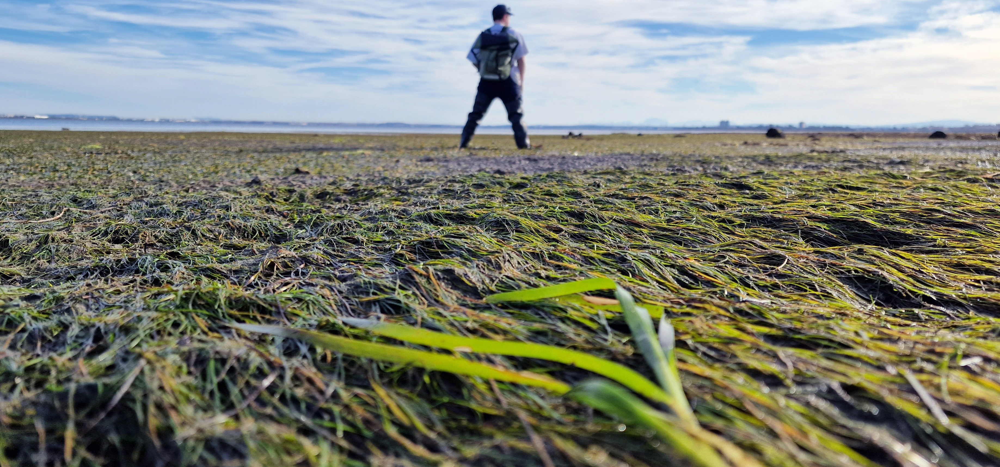{height="1100"}
:::

